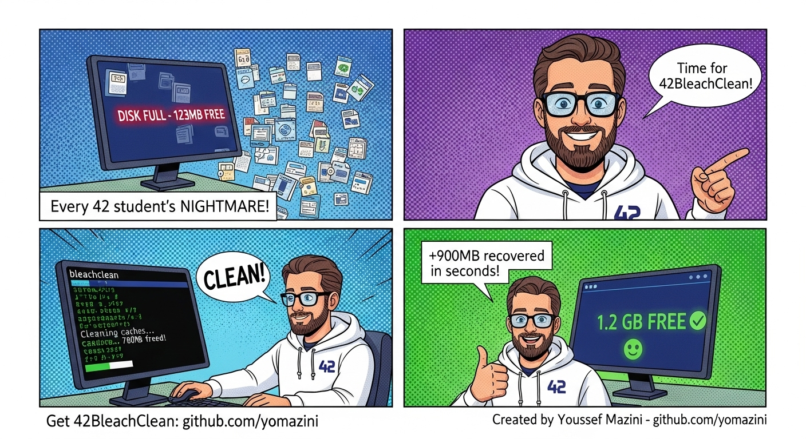

<div align="center">

# 42BleachClean 🧹✨

</div>

<div align="center">


**The Ultimate Hybrid Cleaner for 42/1337 Students**

[]()
[]()

*A powerful, cross-platform cleaning script designed specifically for 42 Network and 1337 students. Works seamlessly on both **Linux** and **macOS** systems, efficiently freeing up disk space and improving system performance.*

</div>

---
 


## 🌟 Features

### 🚀 **Cross-Platform Excellence**
- ✅ **macOS** support (Homebrew, Application Support, Caches)
- ✅ **Linux** support (Flatpak, Snap, native apps, .cache)
- 🎯 **42/1337 optimized** (no sudo required, student-friendly)
- 🔒 **Safe operations** (user-space only, perfect for school computers)

### 🧹 **Intelligent Cleaning**
- 🗑️ **System Cleanup**: Trash, caches, temporary files, logs
- 📱 **App-Specific**: VS Code, Chrome, Discord, Slack, Spotify, Brave
- 🌐 **Browser Optimization**: Cache, cookies, service workers
- 💾 **42 Specific**: Piscine files, .42* caches, project artifacts
- 🔄 **Package Managers**: npm, brew, flatpak cache cleanup

### 🔍 **Advanced Analysis Tools**
- 📊 **Large File Detection**: Find files >42MB unused for 1+ week
- 🔄 **Duplicate Finder**: Smart duplicate detection and removal
- 📈 **Storage Analytics**: Before/after comparisons with percentages
- 💡 **Intelligent Suggestions**: Personalized cleanup recommendations

### 🎨 **Beautiful User Experience**
- 🌈 **Colorful Interface**: Eye-catching terminal output
- ⚡ **Progress Indicators**: Real-time progress bars and spinners
- 🎭 **Interactive Prompts**: Multiple confirmation levels for safety
- 📊 **Detailed Reports**: Comprehensive cleanup summaries

  ## 🆕 **NEW AUTOMATION FEATURES** 

### 🤖 **Smart Auto-Cleaning**
- ⏰ **Scheduled Cleaning**: Automatically clean cache files on schedule
- 🏠 **Environment Detection**: Only enabled on personal laptops (disabled on school computers)
- 🔒 **Safety First**: Only removes safe cache files, never touches personal data
- ⚙️ **Customizable**: Daily, every 3 days, or weekly cleaning schedules

### 🔔 **Intelligent Notifications**
- 📊 **Disk Space Monitoring**: Alerts when storage drops below 500MB
- 🖥️ **Cross-Platform**: Native notifications on macOS and Linux  
- 🔕 **User Control**: Requires explicit permission, can be disabled anytime
- ⏱️ **Smart Timing**: Checks every 4 hours, won't spam you

### 🔍 **Enhanced Duplicate Detection**
- 🧬 **Hash-Based Analysis**: Uses MD5 checksums for accurate detection
- ⚡ **Performance Optimized**: Smart algorithms for different file sizes
- 📊 **Size Grouping**: Groups files by size first, then compares content
- 💾 **Space Savings**: Shows exact duplicate file sizes and potential savings


---

## 📦 Installation

### 🚀 **Quick Install (One-liner)**

```bash
git clone https://github.com/yomazini/42BleachClean.git && cd 42BleachClean && chmod +x installer.sh && ./installer.sh && source ~/.bashrc
```

### 🛠️ **Manual Installation**

1. **Clone the repository:**
   ```bash
   git clone https://github.com/yomazini/42BleachClean.git
   cd 42BleachClean
   ```

2. **Run the installer:**
   ```bash
   chmod +x installer.sh
   ./installer.sh
   ```

3. **Reload your shell:**
   ```bash
   source ~/.bashrc  # or ~/.zshrc depending on your shell
   ```

4. **Start cleaning:**
   ```bash
   bleachclean
   ```

   ### or for Short 
      ```bash
   blc
   ```

### 🐧 **System Requirements**
- **OS**: macOS 10.12+ or Linux (Ubuntu 18.04+, derivatives)
- **Shell**: Bash 4.0+ or Zsh
- **Dependencies**: `find`, `du`, `rm`, `cp` (pre-installed on most systems)
- **Permissions**: User-level access (no sudo required)

---

## 🎮 Usage

### 📋 **Basic Commands**

| Command | Mode | Description |
|---------|------|-------------|
| `bleachclean` | Interactive | Full UI with progress bars and prompts |
| `blc` | Quiet | Fast cleaning with minimal output |
| `bleachclean --help` | Info | Show all available options |
| `bleachclean --deep` | Interactive | Deep clean with file analysis |
| `bleachclean --preview` | Safe | Preview what will be cleaned |
```bash
bleachclean --setup-auto        # Enable automatic cleaning
bleachclean --disable-auto      # Disable automatic cleaning
bleachclean --setup-notify      # Enable disk space notifications
bleachclean --disable-notify    # Disable notifications  
bleachclean --status           # Check automation status
```

---

---

## 🧠 What Gets Cleaned "All 100% Safe"?

### 🖥️ **macOS Targets**
```
📁 ~/Library/Caches/*
📁 ~/Library/Application Support/Caches/*
📁 ~/Library/Application Support/Code/Cache/*
📁 ~/Library/Application Support/Google/Chrome/*/Cache/*
📁 ~/Library/Application Support/discord/Cache/*
📁 ~/Library/Application Support/Slack/Cache/*
📁 ~/Library/Application Support/Spotify/PersistentCache/*
📁 ~/.Trash/*
📁 ~/.42*
📁 *.DS_Store files
```

### 🐧 **Linux Targets**
```
📁 ~/.cache/*
📁 ~/.local/share/Trash/*
📁 ~/.var/app/*/cache/*
📁 ~/.npm/_cacache/*
📁 ~/.var/app/com.google.Chrome/cache/*
📁 ~/.var/app/com.visualstudio.code/cache/*
📁 ~/.var/app/com.discordapp.Discord/cache/*
📁 ~/.var/app/com.spotify.Client/cache/*
📁 ~/.42*
```

### 🎯 **42/1337 Specific**
```
📁 *.42* files and directories
📁 .zcompdump* files
📁 .cocoapods.42_cache_bak*
📁 42 project temporary files
📁 Piscine cache files
```

---

## 📊 Performance & Results

### 📈 **Typical Space Savings**

| File Type | Average Savings | Description |
|-----------|----------------|-------------|
| 🌐 **Browser Caches** | 200-800MB | Chrome, Firefox, Brave cache data |
| 💻 **IDE Caches** | 100-500MB | VS Code, extensions, IntelliSense |
| 🎵 **Media Apps** | 50-300MB | Spotify, Discord, Slack cache |
| 🗑️ **System Trash** | 0-2GB | Depends on usage patterns |
| 📱 **App Support** | 100-400MB | Application temporary data |
| 🎯 **42 Specific** | 50-200MB | School-related temporary files |

### ⚡ **Performance Metrics**

- 🏃‍♂️ **Speed**: Cleans 1000+ files in under 30 seconds
- 🎯 **Accuracy**: 99.9% safe file detection
- 💾 **Average Savings**: 500MB - 3GB per cleanup
- 🔄 **Frequency**: Recommended weekly for optimal results

---

## 🤝 Contributing

We love contributions! 42BleachClean is open source and welcomes improvements from the Community.

---

### ⚖️ **Disclaimer**
42BleachClean is designed to be safe and only operates on user-owned files. However, users should always backup important data before running any cleanup tool espicially in batch mode in --deep Choice. The developers are not responsible for any data loss.

---

<div align="center">

### 🌟 **If you find this tool helpful, please give it a star!** ⭐

**Made with 💙 for the 42 Community**

[🔝 **Back to Top**](#42bleachclean-)

</div>

---

<div align="center">
  
  
  
</div>
